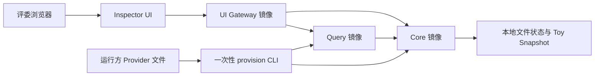

# 评审版架构

Inspector 是唯一公开前端。UI Gateway 负责 Demo 用户会话和最小 BFF 路由；Core
负责文件型 Snapshot、Ontology、KG、证据和审核状态；Query 通过 Core 公开 HTTP
契约读取 Snapshot。评审版不启动 PostgreSQL、Neo4j、MinIO、Streamlit、Evaluation、
BI、Safety 或 MinerU。Provider 配置只在运行时由外挂文件导入，永不写入源码、公开
仓库、镜像或日志。
